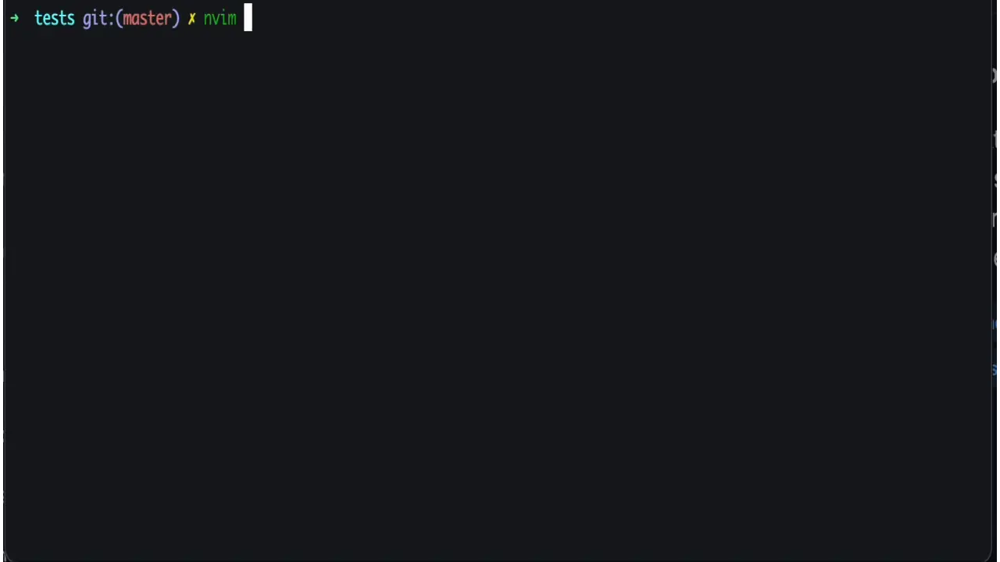

# TestGPT

A command-line tool that uses OpenAI API to generate unit tests for your files automatically.



## Installation 

To use TestGPT, follow these steps:

1. Install TestGPT by running one of the following commands:

   ```zsh
   # Install globally
   npm install -g testgpt@latest
   
   # OR install locally in your project
   npm install testgpt@latest
   ```

2. Request access to [OpenAI API](https://openai.com/api/) and obtain your [API key](https://platform.openai.com/account/api-keys).
   
   You then need to export your OpenAI key. Follow the steps to export for your OS:
   - If you are a macOS user ( or zsh user on Linux ), append this to `.zshrc` in your `home` or `~` directory

   ```zsh
   export OPENAI_API_KEY='Your OpenAI API Key.’
   ```
   
   Then run the command:

   ````zsh
   source ~/.zshrc
   ```
   - If you are a Linux user, append the same line to `~/.bashrc`

   ````bash
   export OPENAI_API_KEY='Your OpenAI API Key.’
   ```

   - If you are a windows user, go to System->Settings->Advanced->Environment Variables, under `System Variables,` click `New` and a new entry with the key `OPENAI_API_KEY` and substitute your OpenAI API Key as value.
   

3. Add a `testgpt.config.json` file to the root directory of your project. you can specify the technologies and tips for each file extension. Here's an example:

   ```json
   {
     ".ts": {
       "techs": ["jest"],
       "tips": [
         "use 2 spaces for indentation",
         "wrap each group of tests in a describe block",
         "Don't forget to import the things you need."
       ]
     },
     ".tsx": {
       "techs": ["jest", "react-testing-library", "userEvent"],
       "tips": [
         "use 2 spaces for indentation",
         "use screen",
         "wrap each group of tests in a describe block",
         "when using user event, use an async function and await the user event",
         "prefer not to use getByTestId",
         "Don't forget to import the things you need."
       ]
     }
   }
   ```

4. Auto-generate unit tests by running this command

   ```bash
   testgpt --inputFile <path to your input file> --outputFile <path to your test output file>
   ```

   Alternatively, you can use the shorthand:

   ```bash
   testgpt -i <path to your input file> -o <path to your test output file>
   ```

   If you don't provide an `--outputFile`, the generated test file will be saved in the same directory as the input file.

   ```bash
   testgpt -i ./src/myComponent.tsx
   # Output file will be ./src/myComponent.test.tsx
   ```

## License

TestGPT is released under the MIT License. Feel free to use it and contribute to it!

> Thanks to OpenAI for generating this README and my unit tests for this project :)
